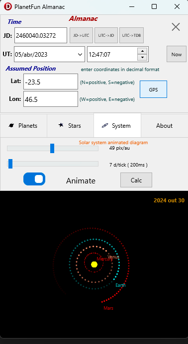

# PlanetFun Almanac 

PlanetFun Almanac module groups different calculation methods to get accurate celestial object positions.
It is used by PlanetFun to position Sun, Moon, planets and stars at a given time.

The module can produce reports about calculations and lists of objects.

# Star Almanac

Star list, Nautical Almanac style:

Navigation star Almanac for 14/abr/2023 12:00:00 UT
    
                  SHA       Decl
    Acamar      315°13.2'  40°12.9'S 
    Achernar    335°21.8'  57°07.2'S 
    Acrux       173°01.1'  63°13.7'S 
    Adhara      255°07.1'  29°00.4'S 
    Al Na-ir    27°34.9'   46°50.9'S 
    Albireo     67°05.2'   28°00.2'N 
    Aldebaran   290°41.5'  16°33.3'N 
    Alioth      166°13.6'  55°50.1'N 
    Alkaid      152°52.6'  49°11.8'N 
    Alnilam     275°39.4'   1°11.3'S 
    Alphard     217°49.0'   8°45.7'S 
    Alphecca    126°04.7'  26°38.0'N 
    Alpheratz   357°36.6'  29°12.9'N 
    Altair      62°01.4'    8°55.5'N 
    Ankaa       353°08.9'  42°10.9'S 
    Antares     112°17.4'  26°29.0'S 
    Arcturus    145°48.9'  19°03.6'N 
    Atria       107°12.7'  69°04.0'S 
    Avior       234°15.2'  59°35.3'S 
    Bellatrix   278°24.6'   6°22.2'N 
    Betelgeuse  270°53.8'   7°24.6'N 
    Canopus     263°53.2'  52°42.7'S 
    Capella     280°24.3'  46°01.4'N 
    Castor      245°58.9'  31°50.4'N 
    Deneb       49°26.9'   45°21.4'N 
    Denebola    182°26.1'  14°26.5'N 
    Diphda      348°49.1'  17°51.7'S 
    Dubhe       193°42.2'  61°37.7'N 
    Elnath      278°04.0'  28°37.6'N 
    Eltanin     90°42.7'   51°28.7'N 
    Enif        33°40.3'    9°58.7'N 
    Fomalhaut   15°16.4'   29°30.0'S 
    Gacrux      171°52.8'  57°14.7'S 
    Gienah      175°44.8'  17°40.3'S 
    Hadar       148°37.6'  60°29.1'S 
    Hamal       327°53.2'  23°34.3'N 
    Kaus Austr. 83°34.3'   34°22.4'S 
    Kochab      137°18.7'  74°03.5'N 
    Markab      13°31.6'   15°19.5'N 
    Menkar      314°08.0'   4°10.7'N 
    Menkent     147°59.0'  36°29.2'S 
    Miaplacidus 221°38.2'  69°49.0'S     
    Mirfak      308°30.9'  49°56.6'N 
    Nunki       75°49.5'   26°16.1'S 
    Peacock     53°08.0'   56°39.5'S 
    Pollux      243°19.1'  27°58.3'N 
    Procyon     244°52.4'   5°09.9'N 
    Rasalhague  95°59.8'   12°32.4'N 
    Regulus     207°35.8'  11°51.2'N 
    Rigel       281°05.5'   8°10.6'S 
    Rigil Kent  139°41.9'  60°55.9'S 
    Sabik       102°04.3'  15°45.3'S 
    Schedar     349°33.3'  56°39.7'N 
    Shaula      96°12.1'   37°07.2'S 
    Sirius      258°27.6'  16°45.0'S 
    Spica       158°23.5'  11°17.0'S 
    Suhail      222°47.2'  43°31.8'S 
    Vega        80°34.1'   38°47.9'N 
    Zuben-ubi   136°58.1'  16°08.4'S 
    
