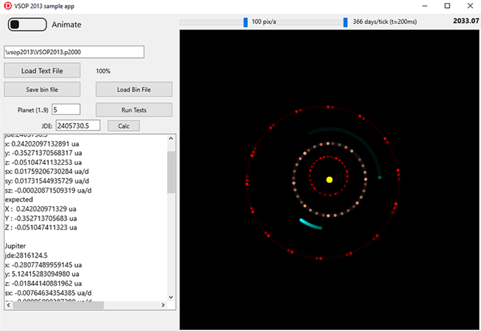

## VSOP2013 for Delphi / PlanetFun app / gravityIntegration / discovery of Neptune

This repository started as a Delphi port of planet ephemerides database VSOP2013.
With time it grew to include:

* VSOP2013 planet data calculation tests and binary data file utility.
* N-to-N gravity integration by leapfrog method.
* Delphi application "PlanetFun" ( a 3d solar system simulation with augmented reality - The app is available on iOS Appstore and Android Google Play ).
* Hipparchus 150 star position calculations ( 150 brightest stars )
* VSOP87 planet position theory - Another planet theory, with smaller data footprint.
* Moon position calculations ( adapted from TMoon component, by Andreas Hörstemeier )

# VSOP2013 for Delphi

VSOP 2013 (Variations Séculaires des Orbites Planétaires) is a high precision planetary position model by G. FRANCOU & J.-L. SIMON - may 2013 ) 
This repo contains a Delphi Pascal port of original Fortran code by the theory authors. 

VSOP2013 calculation machinery uses Chebyshev polynomials to find position and speed of the 9 planets at a time (inside a 9000y range). Algorithm uses optimized indexing to manage a number of tables of coeficients while keeping file sizes minimum.

Tested with D10.3.3, D10.4.1, D11.1 on Win32, iOS and Android. 
Tests are for Firemonkey, but should work with VCL and console app as well.

VSOP 2013 original Fortran code and data files can be found at:

    ftp://ftp.imcce.fr/pub/ephem/planets/vsop2013/ephemerides/
 
VSOP2013 README: ftp://ftp.imcce.fr/pub/ephem/planets/vsop2013/ephemerides/README.pdf
 
Data files are large (400 MB) ASCII text containing Chebyshev polynomial of 1st kind *coeficients*. 
It is organized in 6 files, covering a 9,000 year period in all, as follows:
  
     range                file
     -4500 to -3000       VSOP2013.m4000
     -3000 to -1500       VSOP2013.m2000
     -1500 to 0           VSOP2013.m1000
     0     to +1500       VSOP2013.p1000
     +1500 to +3000       VSOP2013.p2000
     +3000 to +4500       VSOP2013.p4000

Each file is divided in 17122, 32 day intervals. Each interval has 978 coeficients, arranged in groups of 6 per line. File header contains a table of indexes into coeficients for 9 planets: Mercury, Venus, Earth+Moon baricenter, Mars, Jupiter, Saturn, Uranus, Neptune and Pluto.
Each planet has a number of Chebyshev polynomial terms (between 7 to 14 terms). Results are two 3D vectors: position and speed.

The FTP repository contains Fortran code:
* VSOP2013_binfile.f - Parses text file into binary file that allows fast random access.
* VSOP2013_compute.f - Retrieves 32d interval from binary file and computes planet data ( position and speed )

In this Delphi port, the whole ASCII file is loaded into memory tables, for even faster access. 
Once loaded, computations are very fast. 

Object T_VSOP2013_File in pas:
* Parses a data file - Use only files in original format, as the parser relies on fixed positions.
* Save and Load data in custom binary format files, smaller and fast to load (Android apps have a 150MB bundle size limit)
* calculates heliocentric rectangular position and speed ( in UA and UA/day). Planets Almanac. 

# Sample apps
Three sample apps are included in this repository. 
* TestVSOP2013 - Load VSOP2013 text files. Test planet data. 2D visualization. Binary file utility. 
* PlanetFun - Planetary system 3D simulation. Requires downloading and deploying planet textures from 3rd party site plus VSOP2013 binary file (see below). PlanetFun is available as executable for Windows. For Android and iOS download from stores (search "PlanetFun"). 
* gravityIntegration - Integrates planet positions using Newton's universal gravity law and compares to VSOP2013. Shows charts of diferences.. Planets Almanac. 

# Sample app 1: TestVSOP2013
*TestVSOP2013* is a Firemonkey app. 

To use it you have to download at least one of the data files from VSOP2013 FTP repository ( current file is VSOP2013.p2000 )  

* Download VSOP2013.p2000 from FTP repository 
* Set filename and click [Load File] - The app will freeze for a while loading the 400 MB of text data.
* To test a particular planet position, set JD epoch, planet id and click [Calc]
* Check [x]Animate to show a solar system 2D animated chart.  Use trackbars to control scale and speed of the animation. 
* Click [Run tests] to compare some calculation results with expected values from original vsop2013. 
* [Save Binary file] for deploying with *PlanetFun*  ( creates file VSOP2013.p2000.bin )

# Test results

I did not test the original Fortran code, so I used the results on original file VSOP2013_ctl-1.txt.

    Test of Delphi implementation of VSOP2013
    ==========================================
    from VSOP2013_ctl.txt ( original results file)
      JUPITER     JD2405730.5  X: -5.392780445602 ua    Y: -0.805698954496 ua      Z :  0.124332318817 ua  
                              X':  0.001019284060 ua/d  Y': -0.007116469431 ua/d   Z':  0.000005921462 ua/d
						   
    from TestVSOP2013   ( code in this repo )
      Jupiter     jde2405730.5 x: -5.39278044560243 ua   y: -0.80569895449564 ua    z: 0.12433231881710 ua
                              sx: 0.00101928405984 ua/d sy: -0.00711646943146 ua/d sz: 0.00000592146220 ua/d			      
    
    from https://ssd.jpl.nasa.gov/horizons.cgi ( Nasa Horizons. used Jupiter Center and Sun  Center)
      Jupiter     jd2405730.5 (A.D. 1874-Jul-26 00:00:00.0000 TDB )  
                               X =-5.392781657192185E+00 Y =-8.056977928944861E-01 Z = 1.243323711175276E-01
                               VX= 1.019554845438113E-03 VY=-7.116569436623840E-03 VZ= 5.921987272194194E-06

## Sample app 2: PlanetFun

Planet Fun is a Firemonkey solar system 4D simulation. 
It uses VSOP2013 to calculate planet positions for the 9 Planets ( or 8 planets + Pluto ).

Source code:  
    https://github.com/omarreis/vsop2013/tree/master/planetfun
    
PlanetFun readme:
    https://github.com/omarreis/vsop2013/blob/master/planetfun/README.md

In order to compile and run this app, you will need to:
* Download VSOP2013.p2000 data file from VSOP2013 FTP repository. Convert it to binary format using TestVSOP2013
* Download and include planet textures from 3rd party website

# PlanetFun app for Android
* https://play.google.com/store/apps/details?id=com.omarreis.planetfun

# PlanetFun app for iOS
* https://apps.apple.com/us/app/planet-fun/id1525941640

# PlanetFun for Windows 
Installs executables TestVSOP2013.exe, PlanetFun.exe, gravityIntegration.exe and assets.
* https://github.com/omarreis/vsop2013/releases/download/1.2/setupPlanetFun_win32_v11.exe

( Windows installer executable is authenticode signed by "Carvalho e Reis Ltda" )

## Sample app 3: gravityIntegration 

Windows app. Integrates planet positions using Newton's universal gravity law and compares to VSOP2013. Shows charts of diferences (residues).

* see: https://github.com/omarreis/vsop2013/tree/master/gravityIntegration

## discovery of planet Neptune
Numbers related to the discovery of the planet Neptune, in 1846. 
* see: https://github.com/omarreis/vsop2013/blob/master/gravityIntegration/NeptuneDiscovery/README.md
* O descobrimento de Netuno (portugues): https://github.com/omarreis/vsop2013/blob/master/gravityIntegration/NeptuneDiscovery/leiame.md 

## VSOP87

VSOP 87 is described in Meeus book and implemented here in Pascal.
See *VSOP87* and *VSOP87/Demo* folders

## Hipparchus 150 stars

A star position calculation.
See *TestH150* folder.

## Facebook
FB page: https://www.facebook.com/vrtoolsoftware

## tiktok videos

* TestVSOP2013 - https://www.tiktok.com/@omar_reis/video/6850534226689805574
* PlanetFun1 https://www.tiktok.com/@omar_reis/video/6859411602031119622
* PlanetFun2 https://www.tiktok.com/@omar_reis/video/6923560996493659398
