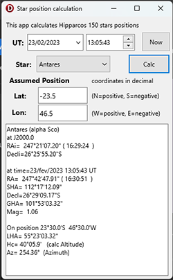

# Test app for Hipparchus 150 stars position calculator

*TestH150Stars* App for Delphi Firemonkey platform.
This app tests code implemented in StarData.pas

Uses Hipparchus 150 Stars ( the most visible stars )
Star position data for J2000.0 is embedded in StarData.pas, so no data file is necessary.
Star positions are corrected for proper motion, Aberration, Nutation and precession.

Only the navigation stars (56) have common names. 
Other stars are designated by the greek letter and 3 character constellation code.

Position calculation algorithms are from the book:

* "Astronomical Algorithms" by Jean Meeus (1st and 2nd editions)

Parameters:

* select Star name
* set Date ( Universal Time a.k.a GMT ) 
* set navigator Assumed Position ( Lat and Lon )

returns Star celestial position:

* RA ( Right Ascension in degrees and hours )
* Decl ( Declination in degrees ) 
* GHA ( Greenwich Hour Angle )
* SHA ( Sidereal Hour Angle )
* Magnitude ( star brightness, lower number=more  bright ) 

At navigator's Earth position:

* LHA ( Local Hour Anmgle )
* Hc ( Calculated Altitude) 
* Az ( Azimuth )

## Dependencies  

Uses files from /omarreis/vsop2013

## Screenshot

