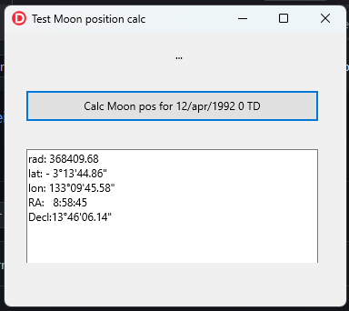

# Moon position calculator

This code was adapted from Andreas Hörstemeier TMoon component v2.0        
for Delphi 6  - Original (c) statement                                     

* Copyright 1997-2001 Andreas Hörstemeier  Version 2.0 2001-07-07  
* this component is public domain - please check the file moon.hlp for more detailed info on usage and distributing                               
see http://www.hoerstemeier.com/delphi.htm                                 

Algorithms from the book "Astronomical Algorithms" by Jean Meeus           

  * ELP2000 theory by Chapront-Touze                                               
  * Astronomical Algorithms, Jean Meeus (1991) Ed I                        
  * AA - 2nd edition         (1998) <- much expanded and corrected        
 
TMoon functionality was adapted to newer compiler and merged w/ other AA code in this repo.

## Dependencies
  
      /omarreis/vsop2013
      
