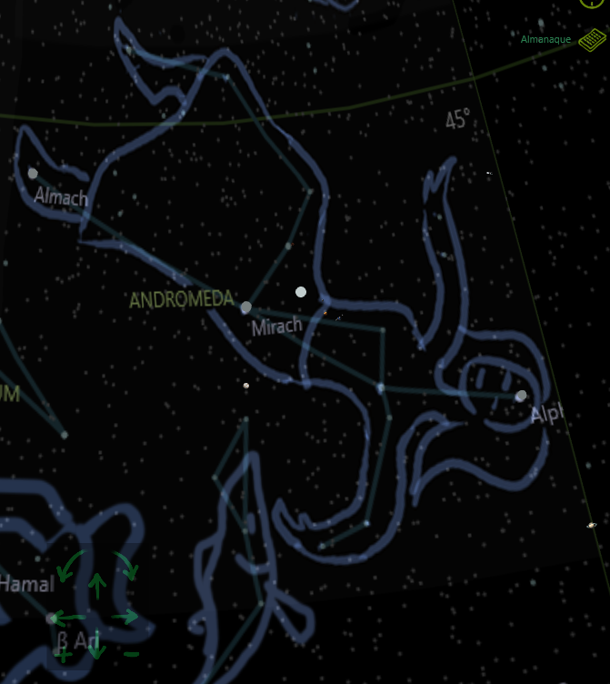
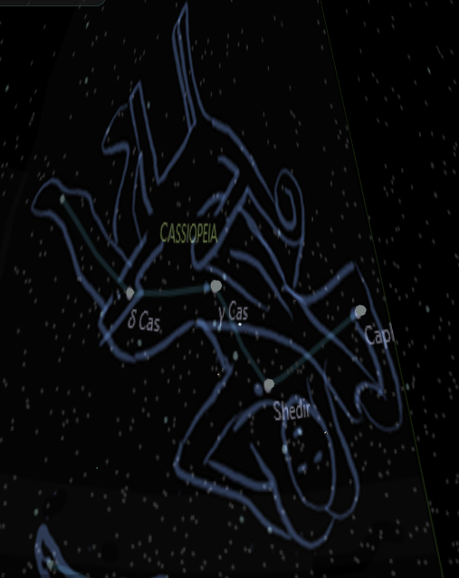
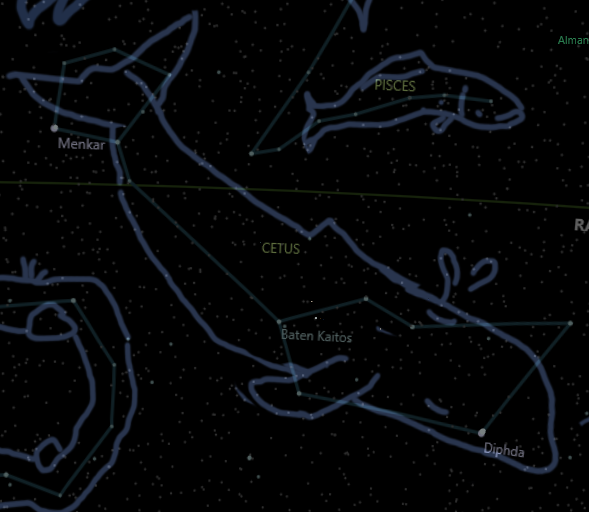
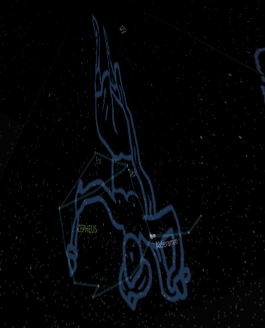
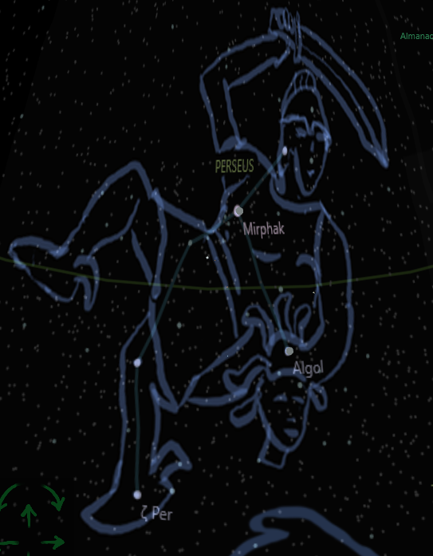

## The Sacrifice of Andromeda

Andromeda was the most beautiful maid in all Ethiopia. Her mother, Queen Cassiopeia, was so proud of her that she often boasted Andromeda to be more lovely than the Nereids, Poseidon girlfriends.

One day, Poseidon heard Cassiopeia's vain words and was enraged. He decided to punish the queen and her people by sending a terrible sea monster to attack their shores. The monster, Cetus, devoured people and animals, and destroyed ships and houses.

The king of Ethiopia, Cepheus, was desperate to save his kingdom from the wrath of Poseidon. He consulted an oracle, who told that the only way to appease the god was to sacrifice his sweet daughter Andromeda to the sea monster.

Cepheus was heartbroken, but he had no choice. He ordered his men to chain Andromeda to a large rock by the sea, where she would be exposed to the monster. Andromeda cried and pleaded, but no one could help her.

Meanwhile, Perseus, the son of Zeus and Danae, was flying over the sea with his winged sandals. He had just killed Medusa, the Gorgon whose a simple gaze could turn anyone into stone. He carried her severed head in a bag, along with his sword and helmet that made him invisible.

As he flew over Ethiopia, he saw Andromeda chained to the rock. He was struck by her beauty and courage, and felt a surge of pity and love for her. He decided to rescue her.

Perseus landed near the rock and revealed himself to Andromeda. He told her his name and his deeds, and asked her to be his wife. Andromeda was overjoyed and agreed to marry him.

But before they could embrace, they heard a loud roar from the sea. The monster had arrived, and it was hungry for prey. It emerged from the water, a huge beast with scales, claws, teeth, and eyes that glowed with malice.

Perseus put on his helmet and became invisible. He flew towards the monster with the sword in his hand. He dodged its attacks and slashed at its body. But the monster was too strong and fast. It wounded him with its tail and almost caught him in its jaws.

Perseus realized that he could not defeat the monster with his sword alone. He had one last weapon: Medusa's head. He took it out from the bag and held it in front of the monster's face. The beast looked at it and attacked, but was instantly turned to stone, falling to the ocean bottom.

Perseus had saved Andromeda from the monster. He cut off her chains and lifted her in his arms. They flew away from the rock and landed on the shore, where they were greeted by Cepheus and Cassiopeia.

The king and queen were overjoyed to see their daughter alive and well. They thanked Perseus for his heroism and welcomed him as their son-in-law. They prepared a feast to celebrate their wedding.

But not everyone was happy with this outcome. Phineus, Andromeda's uncle and former suitor, was furious that Perseus had taken his bride. He gathered his men and attacked Perseus during the feast.

Perseus fought back with his sword, but he was outnumbered by Phineus' men. He had one last resort: Medusa's head. He took it out of the bag and showed it to Phineus and his men. They all looked at it and turned to stone.

Perseus had defeated his enemies with Medusa's head. He returned to Andromeda's side and kissed her tenderly.

They were finally free to live happily ever after. Perseus was so excited that he forgot to put the Medusa head back in the bag. As Perseus and Andromeda kissed they both looked to the same side, they saw the green hair of serpents, becoming the most beautiful marble sculpture of all Greece.

Zeus then decided to set the whole Andromeda family, and Perseus, and Cetus, as constellations covering half of the sky...

Story made up by Bing Chat AI