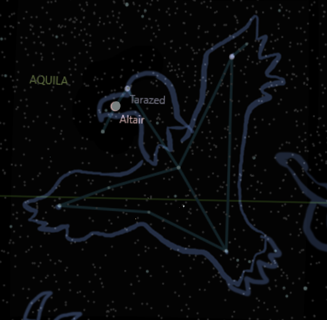

## Aquila, Zeus and Europa

Aquila was a young eagle who lived in the mountains. He was the son of Zeus, the king of gods, and Aetos, a mortal woman who loved birds. Aquila inherited his father's power and his mother's grace, and he was admired by all the eagles.

Aquila had a special bond with Zeus, who often visited in his nest and taught him many things. Zeus also gave Aquila a golden feather, symbol of his love and protection. Aquila cherished the feather and wore it proudly on his chest.

One day, Zeus asked Aquila to do him a favor. He told he had fallen in love with a beautiful princess named Europa, who lived in Phoenicia. He wanted to bring her to Crete, where he had prepared a palace. He asked Aquila to help him carry Europa across the sea.

Aquila agreed to help. Both flew to Phoenicia. Zeus disguised himself as a white bull, and mingled with the herd of cattle that belonged to Europa's father. Europa saw the bull and was charmed by its style. She approached and stroked his fur. The bull seemed to like her, and bowed as for her to climb on its back. Which she did..

Zeus took advantage of the situation and ran towards the sea with Europa on the back. Europa was scared and cried for help, but no one heard. Zeus reached the shore and jumped into the water, swimming towards Crete.

Aquila followed from the air, keeping an eye on them. He saw that Europa was holding on to the bull's horns, but she was all wet and cold. He felt sorry for her and decided to give some comfort. He flew close to her and spoke.

"Don't be afraid, princess," he said. "The bull is my father Zeus, king of all gods. He loves you and wants to make you his queen. We are going to Crete, where he has prepared a palace. You will be happy there, trust me."

Europa was surprised to hear Aquila's voice, and she looked up at him. She saw a majestic eagle flying above her, with a golden feather on his chest. She felt he was telling the truth.

"Who are you?" Europa asked.

"I am Aquila, the son of Zeus and Aetos. I am here to help you and my father"

Europa smiled and thanked him for his kindness. She felt calm and was curious about her destiny.

Aquila smiled back at Europa and had a warm feeling.

The journey across the sea continued, they talk and laugh with each other. Zeus noticed their interaction, and he became jealous and angry. He did not like that his son was flirting with his woman, and decided to punish him.

Zeus waited until they reached Crete, where he left Europa on the shore and revealed his true form to her. He then turned to Aquila and glared at him.

"How dare you betray me, son?" Zeus thundered. "You have disobeyed me and tried to seduce my woman. You dishonored me and yourself."

Aquila was shocked by his father's words, and tried to explain himself.

"Father, I did not betray you or seduce Europa," Aquila said. "I only wanted to help her and make her feel comfortable. I admit that I love her, but I respect your choice and I would never harm her."

Zeus did not listen to Aquila's words, and did not believe him. He was blinded by rage and jealousy. Zeus decides to punish him severely.

He took away Aquila's golden feather, which was his symbol of love and protection. He then threw a lightning at him, which hit in the chest and wounded him badly.

Aquila fell from the sky, bleeding and screaming in pain. He landed on the beach near Europa, who was horrified.

She ran to Aquila's side and tried to help him. She held him in her arms and cried.

"Aquila, please don't die," Europa said. "I love you too." Aquila looked at Europa with dying eyes and smiled weakly.

"I love you too Europa"

He then closed his eyes and breathed his last.

Europa wept for Aquila's death, and she cursed Zeus for his cruelty.

She refused to go with Zeus to his palace, and she stayed by Aquila's body until she died in grief.

Zeus was saddened by Europa's death, and regretted his actions. He realized that he had been too harsh and that he lost both his son and his lover.

He decided to honor them by placing them among the stars as constellations.

He made Aquila a constellation in the shape of an eagle, with a bright star in his chest where he was wounded. He made Europa a constellation in the shape of a princess, with a bright star in her hand where she held Aquila's golden feather.

He also made a constellation in the shape of a bull, which represented himself and his love for Europa.

He put them close to each other in the sky, so that they could be together forever.

The constellation of Aquila represents the eagle who was the son of Zeus and Aetos, and who fell in love with Europa, the princess who was carried away by Zeus in the form of a bull. The constellation of Europa represents the princess who loved Aquila and died of grief for him. The constellation of Taurus represents the bull that was Zeus in disguise, who loved Europa and killed Aquila.

* story made up by Bing Chat AI 
