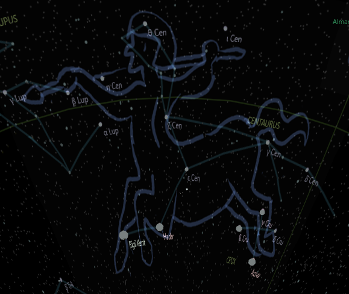

## Centaurus

Centaurus was a lonely king who ruled over a land of half-human, half-horse creatures called centaurs. He was the only one of his kind who had a human head and torso and a horse's body. The other centaurs had animal heads and human bodies, and they were wild and savage.

Centaurus was the son of Apollo, the god of the sun, and Cyrene, a nymph who loved horses. Apollo had fallen in love with Cyrene when he saw her wrestling a lion on a mountain. He took her to Libya, where he built a city for her and made her the queen. He also gave her a gift of a golden chariot pulled by winged horses.

Cyrene gave birth to Centaurus, who inherited his father's beauty and his mother's passion for horses. He grew up in Libya, where he learned to ride and tame the winged horses. He also learned to play the lyre and sing from his father, who often visited him.

Centaurus was happy in Libya, but he also felt different from his people. He did not look like them, and he did not share their interests. He longed for adventure and exploration, and he dreamed of seeing other lands and cultures.

One day, he decided to leave Libya and travel the world. He took his favorite winged horse, Pegasus, and flew across the sky. He saw many wonders and met many people, but he also faced many dangers and challenges.

He came across a land of giants called Nephilim, who tried to capture him and kill him. He escaped from them with his speed and cunning.

He came across a land of fire called Vulcania, where he met Hephaestus, the god of fire and metalwork. Hephaestus taught him how to forge weapons and armor from iron and bronze. He came across a land of water called Atlantis, where he met Poseidon, the god of the sea and earthquakes. Poseidon taught him how to control the waves and the winds.

Centaurus learned many things from his travels, but he also became more lonely. He did not find anyone who looked like him or understood him. He wished he had someone to share his experiences with.

He finally came across a land of mountains called Thessaly, where he met Chiron, another centaur who had a human head and torso and a horse's body. Chiron was the son of Cronus, the leader of the Titans, and Philyra, an Oceanid nymph.

Cronus had disguised himself as a horse to seduce Philyra, but he was discovered by his wife Rhea. To escape Rhea's wrath, Cronus and Philyra changed themselves into horses and ran away. Philyra gave birth to Chiron, who was rejected by both his parents and grew up alone.

Chiron was raised by Athena, the goddess of wisdom and war, who taught him many arts and sciences. Chiron became a great teacher and healer himself, and he mentored many heroes and demigods, such as Hercules, Jason, Achilles, Asclepius, and Peleus. He was also a friend of Artemis, the goddess of hunting and wildlife.

Centaurus was amazed by Chiron's knowledge and kindness, and he felt an instant connection with him. He decided to stay with Chiron in Thessaly, where he learned from him and helped him with his students.

Chiron was delighted by Centaurus' curiosity and enthusiasm, and he felt a deep friendship with him. He welcomed him as his brother in Thessaly, where he taught him and shared his secrets.

story by Google Bard 