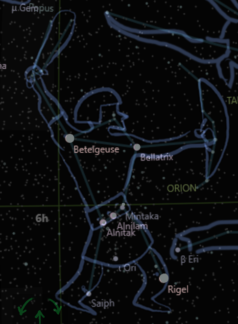
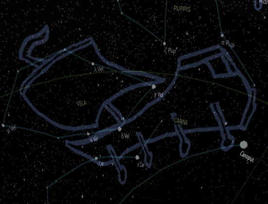

## The Hunt for the Golden Fleece

Orion was a mighty hunter who loved adventure and glory. He was son of Poseidon, the god of the sea, and Euryale, the daughter of King Minos of Crete. He inherited his father's power over the waves and his mother's beauty and courage.

One day he heard of a legendary quest that would bring fame and fortune. It was the hunt for the golden fleece, the skin of a winged ram that was guarded by a fearsome dragon. The fleece had magical properties and could heal any wound or disease.

Orion decided to join the quest, along with other heroes such as Jason, Heracles, Atalanta, and Medea. They sailed on the ship Argo, guided by the constellation of the same name. Along the way, they faced many dangers and challenges, such as the harpies, clashing rocks, tricky sirens, and the Amazon warriors.

Argo is the ship in Vela constellation

Orion proved himself to be a brave and skilled. He used his bow and arrows to shoot down many enemies and beasts. He also used his power over the sea to calm the storms and navigate the waters. He became friends with Heracles, who admired his strength and valor. He also fell in love with Atalanta, who was as swift and agile as he was.

When they reached Colchis, they were welcomed by King Aetes, who agreed to give them the fleece if they could perform three impossible tasks. The first was to plow a field with fire-breathing bulls. The second task was to sow the teeth of a dragon and fight the armed men who sprang from them. The third task was to overcome the dragon that guarded the fleece.

Orion volunteered to do the first task. He used his power over the sea to cool down the bulls' fire and tame them. He then plowed the field with ease and returned to his companions.

Jason took on the second task. He sowed the dragon's teeth and waited for the men to appear. He then threw a stone among them, causing them to fight each other until they all died.

Medea helped Jason with the third task. She was a sorceress who had fallen in love with him. She gave him a potion that made him invisible and told him how to sneak past the dragon and grab the fleece.

Jason succeeded in getting the fleece, but he had to flee from Colchis with Medea, who had betrayed her father. Orion and the others followed them to the Argo, pursued by Aetes' navy.

They managed to escape by passing through another constellation, Scorpius, which was a giant scorpion that lived by the sea. Orion used his bow and arrows to shoot at its eyes and sting, while Jason used his power over the wind to sail faster.

They finally reached Greece, where they celebrated their victory and divided their spoils. Orion received a part of the fleece as a reward for his deeds. He also married Atalanta, who had proven herself to be his equal in hunting.

Orion lived happily with his wife for many years, until he met his tragic end. He was killed by Artemis, the goddess of hunting, who either loved him or hated him, depending on different versions of the story. Some say that she shot him with an arrow out of jealousy or anger. Others say that she did it by accident or as mercy.

After his death, Zeus placed him among the stars as a constellation, where he can still be seen today. He holds his club and shield in his hands, ready for battle. He wears his belt and sword around his waist, symbols of his courage and skill. He also has his faithful dog Sirius by his side, who follows him wherever he goes.

Orion is one of the most recognizable constellations in the sky. Orion lies on the celestial equator, making him visible from both hemispheres. It is also one of the brightest constellations, with two of the ten brightest stars in Rigel and Betelgeuse.

Orion is admired by many people who look up at him and remember his story. A hero who inspires us to pursue our dreams and overcome challenges. And fighting sedentary lifestyle.

Bing chat text
