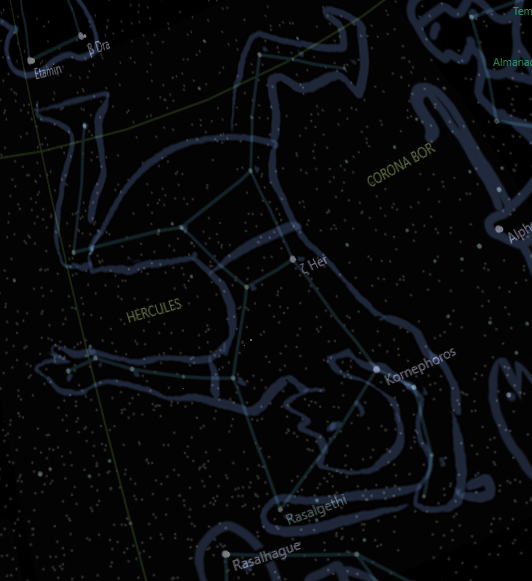

Hercules and Leo constellations

In the mainland Greece there once lived a fearsome Lion that terrorized the countryside. The lion was said to be invulnerable to weapons and had killed many people and animals.

One day a young man named Heracles (a.k.a. Hercules to Romans) was challenged to kill the lion as one of his twelve labors. Heracles was a powerful hero, but he knew it would be no pic-nik to defeat that lion.

Heracles tracked the lion to its cave. The lion was waiting for him, and charged with claws and teeth. The surprised Heracles fought bravely, but the lion was just too strong. The lion's skin was impervious to weapons. Heracles took the severe beating as he could. In the end he managed to use his enormous strength to suffocate the animal.

The constellation Leo is said to represent the lion that Heracles killed. The brightest star in the constellation is Regulus, the lion's heart. Other stars in the constellation include Denebola, which is on the lion's tail, and Algieba, on the lion's mane.

The constellation Leo also contains a number of deep sky objects, including the Leo I and Leo II dwarf galaxies, the Leo Triplet of galaxies, and the Leo Ring, a ring of gas and dust that surrounds the constellation.

The story of Heracles and the lion is a reminder that even the most fearsome creatures can be defeated with courage and determination. Of course Heracles actions, killing all those wild animals, would not be acceptable today, when many forms of wild life are endangered.

( Google Bard story )