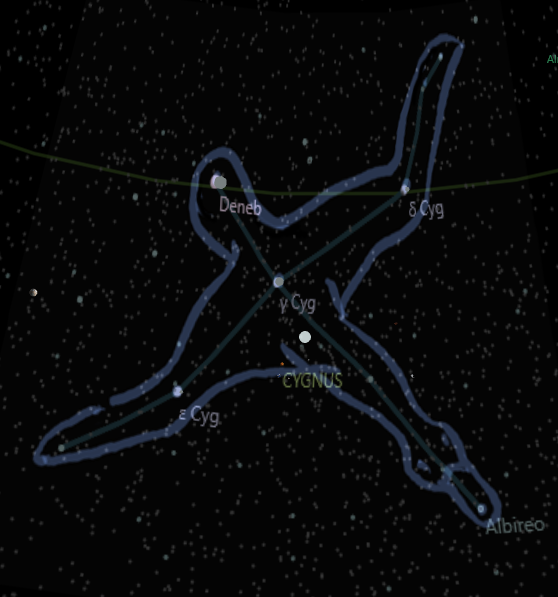
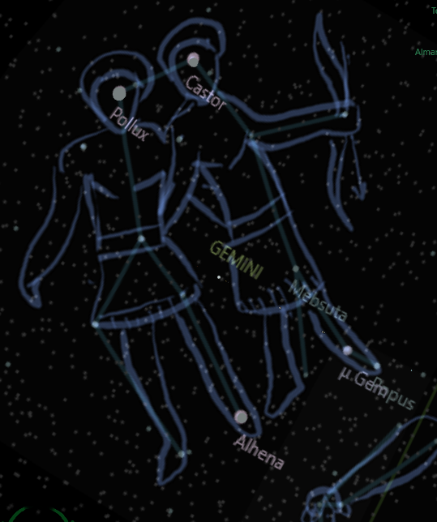

# Leda, Swan and twins

Long ago there was a beautiful queen called Leda, wife of the king of Sparta. One day she was walking by a lake, and saw a magnificent swan in the sky. She was captivated by its grace and beauty, and decided to follow it.

The swan landed on the shore. Leda approached gently. She stroked its feathers and spoke to it softly. The swan seemed to like her, and it nuzzled her cheek. Leda felt a strange attraction to the swan, and embraced it.

But the swan was no ordinary bird. It was Zeus who had disguised himself to seduce Leda. He had seen her from Mount Olympus and had fallen in love. Zeus waited for the right moment to approach, and chosen the form of a swan because he knew she was into birds.

Zeus and Leda made love by the lake. She didn't know that the swan was Zeus.

She returned to her husband as if nothing had happened. But soon she realized that she was carrying two eggs in her womb, one from Zeus and one from the husband.

The eggs hatched and Leda gave birth to four children: two boys and two girls. The boys were Castor and Pollux, and the girls were Helen and Clytemnestra. Castor and Clytemnestra were the children of the King, and they were mortal. Pollux and Helen were the children of Zeus, and they were immortal.

Castor and Pollux grew up to be inseparable twins. They were handsome and brave, and they loved to hunt and fight. They joined many adventures together, such as the hunt for the Caledonian Boar and the voyage of the Argonauts. They also rescued their sister Helen from Theseus, who had kidnapped her.

Castor and Pollux had fallen in love with two sisters, Phoebe and Hilaeira, who were betrothed to their cousins Idas and Lynceus. The twins decided to elope with the sisters, but they were pursued by their angry cousins.

A fierce battle ensued between the four men, and Castor was fatally wounded by Idas. Pollux was devastated by his brother's death, and he killed Lynceus in revenge. Idas was about to kill Pollux too, but Zeus intervened and struck him down with a thunderbolt.

Pollux begged Zeus to let him die with his brother, or to make him mortal so that they could share their fate. Zeus was moved by his son's love, and he offered him a choice: he could either stay immortal in Olympus with the gods, or he could spend half of his time in Hades with his brother.

Pollux chose the latter option, and Zeus granted his wish. He also placed them among the stars as a constellation, so that they could be together forever in the sky.

The constellation of Gemini represents the twins Castor and Pollux, who were born from an egg after their mother Leda was seduced by Zeus in the form of a swan. The constellation of Cygnus represents the swan that Zeus used to disguise himself, which also symbolizes his love for Leda.

And that is how I made up a story relating the Cygnus swan to the Gemini twins 

* Story by Bing chat 