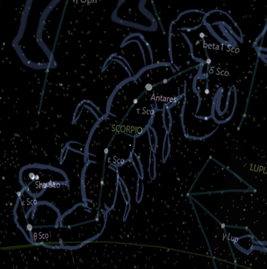

## Orion and Scorpio

Orion was a hunter who lived in the woods. He was skilled with the bow and the spear. He was proud and arrogant, and boasted that he could kill any beast on earth.

Scorpius was a giant scorpion that lived in the desert. He was fierce and venomous, and he feared no one. Cunning and vengeful, he hated anyone who trespassed on his territory.

At some point Orion came to the desert looking for new challenges. He saw Scorpius on a rock and decided to hunt him down. Took his bow and arrow and aimed at the scorpion's tail.

But Scorpius was no easy prey. He sensed Orion's presence and quickly dodged the arrow. He then emerged from his hiding place and attacked Orion with his pincers and stinger.

Orion was surprised by Scorpius' speed and strength. He tried to fight back with his spear, but he could not pierce the scorpion's hard shell. He realized that he had met his match and started to run.

Scorpius chased Orion across the desert stinging him repeatedly. Orion felt his body growing numb and weak, and fell to the ground.

Scorpius was about to deliver the final blow, when a bright light flashed in the sky. It was Zeus, the king of the gods, who had been watching the fight from above. Zeus was impressed by both Orion's courage and Scorpius' ferocity and decided to honor them by setting them on the sky.

Zeus lifted Orion and Scorpius up to the sky, where they became constellations. But Zeus also wanted to keep them apart, so that they would not continue to fight. That is why Scorpius rises in the east as Orion sets in the west..

Scorpio. Brightest star is Antares, a red giant star on scorpio's heart.

* Story by Bing Chat AI

