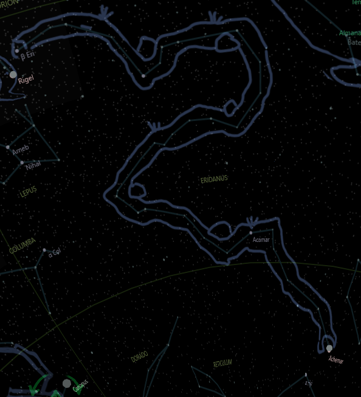
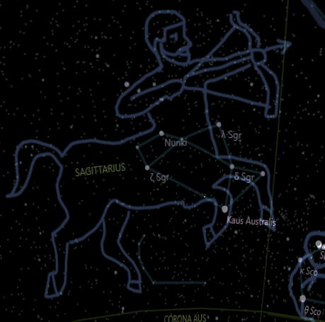

## Myths and characters in western tradition costellations

This folder contains images of constellations captured from app *PlanetFun*
and stories about myths and characters in western tradition costellations.

Some stories, like Andromeda, include multiple constellations.

While images are original, the texts were generated by *AI chat bots* ( Bing and Bard )
and are loosely based on actual greek myths.

Check the stories and images:

* [The Sacrifice of Andromeda](Andromeda.md) constellations Andromeda, Cassiopeia, Cepheus, Cetus and Perseus

* [Aquila, Zeus and Europa](Aquila.md) constellations Aquila and Taurus

* [Centaurus](Centaurus.md) constellations Centaurus and Pegasus

* [The Hunt for the Golden Fleece](GoldenFleece.md) constellations Orion and Vela ( the ship Argo )

* [Hercules and Leo](HerculesLeo.md) constellations Hercules and Leo

* [Leda, Swan and twins](LedaSwanGemini.md) constellations Cygnus and Gemini

* [Orion and Scorpio](OrionAndScorpio.md) constellations Orion and Scorpio

* [Virgo](Virgo.md) constellation Virgo

## Other constellations not in any story (yet)

* Eridanus, the River

 

* Sagittarius, anoother half-man/halh-horse character

    .
    ..
    ...
    ....

by OMAR - aug/23

