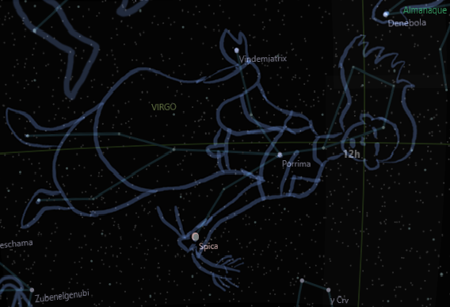

## Virgo Constellation

Long ago there was a beautiful maid named Persephone. She was the daughter of Demeter, the goddess of agriculture. One day Persephone was picking flowers in the meadow when she was abducted by Hades, the god of the underworld.

Demeter was heartbroken and searched everywhere for her daughter. She neglected her duties as goddess of agriculture, and the world economy began to suffer.

Aphrodite, the goddess of love, was moved by Demeter's grief. She decided to help finding Persephone. Aphrodite drop to the underworld and confronted Hades. She told him to release Persephone or she would curse the underworld with eternal drought and unbearable heat.

Hades agreed to release Persephone on one condition: she had to spend a season of the year with him in the underworld.

Persephone reunited with her mother and the farms were once again green and productive.

However, each year, as Persephone returned to the underworld, Demeter would mourn her absence and the world would suffer with a very hot summer.

The constellation Virgo is said to represent Persephone. The brightest star in the constellation is Spica, which is said to represent the ear of wheat that Persephone was carrying when she was abducted.

The story of Persephone and Aphrodite is a reminder of the power of love and loss. It is also a reminder of the cycle of life and death.

    The Maiden in the Sky

    She stands with wheat in hand,
    A symbol of the harvest.
    Her beauty is unmatched,
    A gift from Aphrodite.

    She is Persephone,
    The daughter of Demeter.
    She was taken to the underworld,
    Where she returned each year.

    The constellation Virgo
    Is her eternal form.
    She watches over the world,
    Bringing hope and renewal.

I hope you enjoyed this story about the myth of Virgo constellation. 

* story created by Google Bard 
