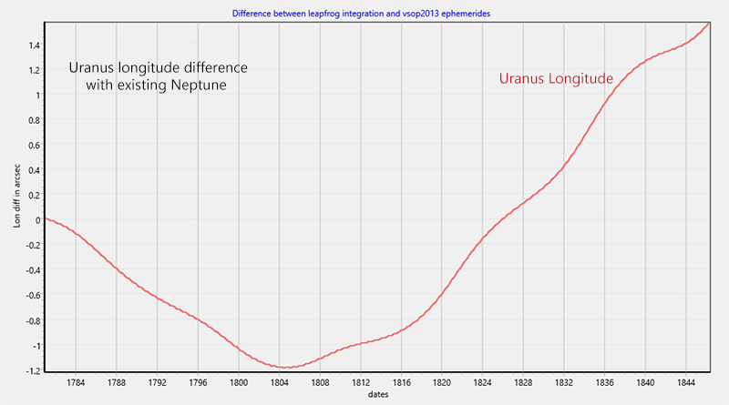
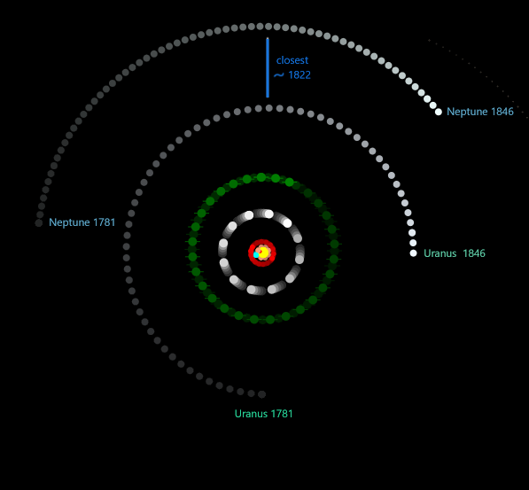

## The discovery of Neptune

In 1846, Urbain Le Verrier predicted the existence of a new planet,
never seen before by astronomers. The planet was later named Neptune.
Verrier guess was based on irregularities in the orbit of planet Uranus.
He noticed perturbations in the orbit when compared 
to expected Newton's gravity integration calculations.  

Verrier guessed that another large planet should exist
next to Uranus to justify the difference between expected and observed positions. 
Not only that, he estimated the position of the new planet, 
which was later confirmed by Berlin Observatory and reported to be 
near Verrier's prediction.

By the same time, english astronomer John Couch Adams was making
similar predictions, but published his results a little later.
Anyway, both are to be commended.

Details of this amazing discovery are missing ( at least for me )
so I did a numeric exercise to reconstruct some of the 
numbers Verrier had. 

I should notice that I'm not an astronomer or historian.
I just messing with planet ephemerides and numerical integration software.

## some numbers

Uranus was discovered in 13/mar/1781 by William Herschel.
So, by 1846, astronomers had about 65 years worth of Uranus observations.

65 years = 23741 days

Uranus revolution period (its "year") is 30684 Earth days, or 84 Earth yers. 
By 1846, astronomers recorded have 77% of Uranus revolution around the Sun.  
Still the planet was misbehaving to the eyes of the astronomer.

To simulate the planet observations at the time, I'm going to use
vsop2013 ephemerides.  And leapfrog integration will be used
to simulate the calculations Verrier and Adams had.

   See leapfrog integration read-me: 
   https://github.com/omarreis/vsop2013/blob/master/gravityIntegration/README.md 

Using the leapfrog integration app *gravityIntegration* select:
  * [x]Uranus chart
  * comparison=Longitude, interval=2741 days, DT=0.5, starting 13/03/1781 
  * click Pluto and Neptune out of existence ( select planets and uncheck *Exists* []checkbox )
  * click [Build charts]

In the resulting chart below we see that Uranus behaves nicely up to 1820, 
then it starts to drift away. By 1846, time of Neptune discovery, 
Uranus longitude integration was already 140 arcsec off,
a large difference that was certainly observable at the time.

If we put back Uranus into the integration, we see that the 
longitude difference falls to 1.4 arcsec, or 1% of previous chart.

If we look at the actual positions chart of the planets in the period (below),
we see that in 1781, Uranus was about one quarter of revolution
behind Neptune.  Uranus revolution, being closer to the Sun,
is faster, so it catches up and eventualy, around 1820, 
they meet at nearest point.   

At this point, at a small distance, gravity force between planets 
is maximum, but the force direction points to the orbit radius,
difficult to observe, and not affecting the planet's longitude. 

After 1820 however, faster Uranus picks the orbit lead, with Neptune
dragging it from behind.  As time passes this drag from the unknown   
planet accumulates.  In 1846 the planet longitude was more than 
2 arc minutes too slow in relation to values expected by 
integrating gravity forces.

This, I guess, is what made Verrier and Adams consider a new planet.
They also relied on Kepler 3rd law. Since the new planet was 
left behind by Uranus, its orbit was slower and hence more distant
from the Sun.  Since the planets had meet around 1820, the new planet 
must have been with similar longitude at that time. Since it moves more slowly 
than Uranus, in 1846 it must be closer to that point, say at 1/8 of the orbit 
( in 1846 Uranus was already about 1/4 into the new orbit )

In the end, we know that Neptune revolution period is 60189 Earth days.
Period between the 2 planet meetings (closest point) is 62594 Earth days.

My 5 cents.
