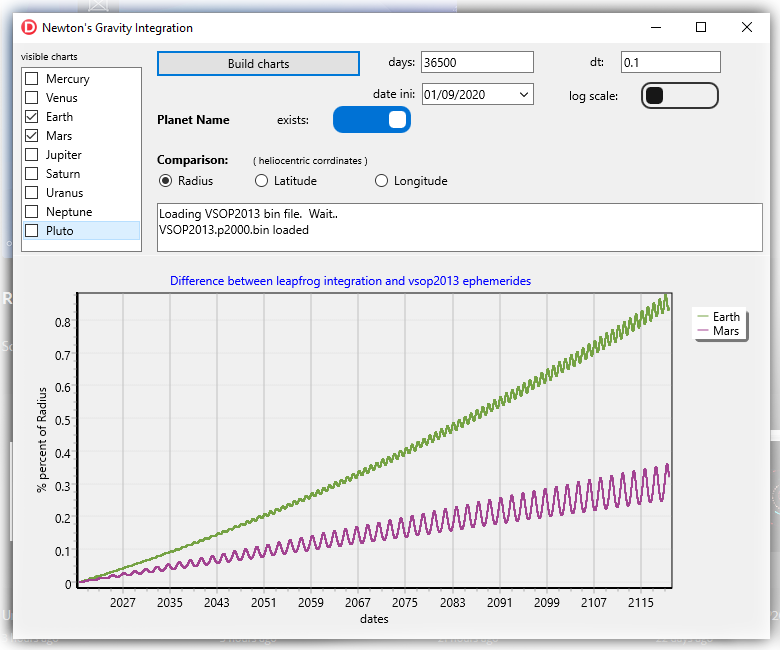
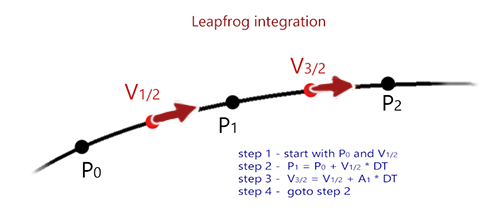

## Newton's Gravity Integration

*GravityIntegration* app implements Newton's gravity integration over time.

It calculates planet's position and speed by integrating the attraction forces
between the 9 planets and the Sun. And uses VSOP2013 ephemerides as basis for comparison.

It produces charts of differences between planet's calculated and "observed" positions.
You can chart differences in heliocentric radius, latitude or longitude.

## Leapfrog integration
Newton's Universal Gravitation formula for the force between two objects is simple: 

    F = G * M1 * M2 / D^2
    where
      G = Universal gravitation constant
      M1, M2 = masses of objects
      D = Distance between objects centers
    
Calculating 

