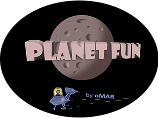
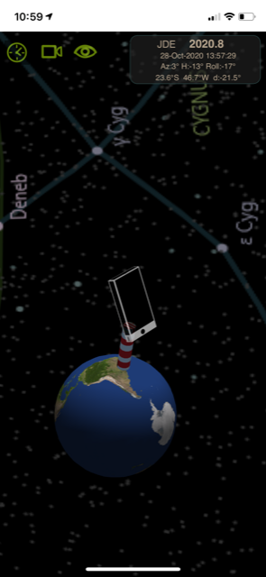
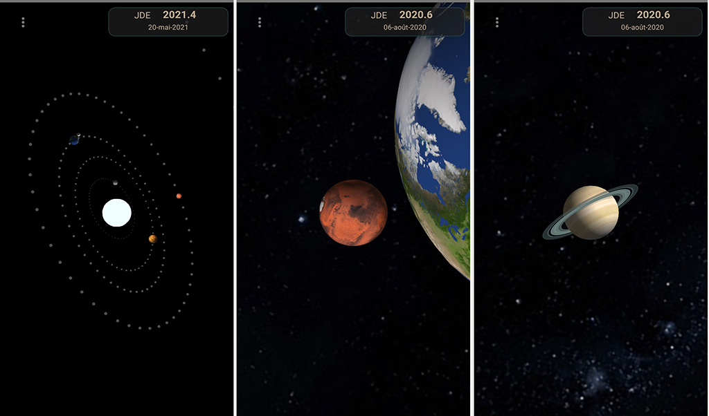
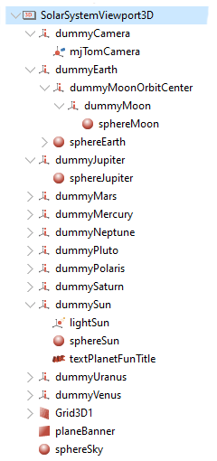

# PlanetFun      

### tl;dr - *PlanetFun* is a 4d solar system simulation with augmented reality. Celestial object spheres are rigged to astronomical almanac, resulting in realistic positions and movements. 

*Download app for iOS or Android from your app store. search for "PlanetFun"*

The app is developed in Pascal ( Delphi ). It uses standard Firemonkey 3d infrastructure. 
Tested on Windows, Android and iOS (currently Delphi 10.4.1)

Full app source code is available at:

* https://github.com/omarreis/vsop2013/tree/master/planetfun

## release notes

nov-20 - PlanetFun version 1.4 released
* Added toolbar for camera manipulation
* Moon correct position ( using Astronomical Almanac )
* release for iOS and Android 

oct-20 - PlanetFun version 1.3 released
* Integrated phone sensors to the 3D simulation ( GPS, accelerometer and mag compass )
* A fairly large *lighthouse* is positioned at your GPS position
* On the lighthouse there is a phone. The virtual phone attitude (Azimuth,Elevation and Roll) is controlled by phone sensors 
* Target (=attach) the *camera* to the *phone* to enter augmented reality mode.  
* Permissions for "sensor use while using the app" required

# Program features
* Multi platform: Android, iOS and Windows
* Solar system *animation* with configurable speed
* Choose camera target (Sun, planets, lighthouse or phone)
* Set date/time bewteen years 1500 and 3000
* Configurable camera distance-to-target
* Touch gestures: one finger pan, two finger zoom and two finger rotation (on mobile)
* Mouse events: mouse-move, Shift mouse-move and Alt mouse-move (on Windows)
* Planet orbit dots. Each orbit is represented by 52 dots ( For the Earth, it is 1 dot per week) )
* Solar system heliocentric axis (x and z)
* VSOP2013 planet ephemeris usage sample
* realistic Moon position ( except for orbit size )
* Current catalog is small: Sun, 9 planets and Moon
* Sky background with 40k stars
* Star and constellation names
* constellation lines
* Sensor fusion allows positioning the light house on GPS position, and set phone attitude acording to gyro and compass
* Attach camera to the phone to enter augmented reality mode

# Planet positions

Planet positions are calculated using VSOP2013 planet database ( see https://github.com/omarreis/vsop2013 ). This library calculates planet's heliocentric coordinates for epochs 1500 to 3000  ( VSOP2013 by Francou and Simon )

    VSOP2013 original FTP repository: ftp://ftp.imcce.fr/pub/ephem/planets/vsop2013/ephemerides/

For speed and small bundle size, PlanetFun app uses a custom binary version of VSOP2013 data. This is the same idea as original vsop2013 theory (i.e. using a fixed size binary record to allow fast record access), but with a different implementation, as it is difficult to share binary record formats across different languages ( Fortran and Pascal ). 

Steps to obtain VSOP2013 binary data file for deploying with *PlanetFun*:

* Download VSOP2013.p2000 from the FTP repository above ( a 400 MB text file) 
* Use program *TestVSOP2013* to Load VSOP2013.p2000 text file.
* Save binary file VSOP2013.p2000.bin.   Do *not* use binary files from original FTP repository.  Binary files for this app use a different custom format.
* Deploy file VSOP2013.p2000.bin to app's documents folder. 

Resulting binary file is *only* 131 MB and doesn't require parsing to load. Loads much faster. 

The scale factor between astronomical units and the app's 3D world is 1.0:     
     1.0 AU = 1.0 3D-world-unit  
    
ex: Earth orbit radius is ~around~ 1.0 3D-world-units

# 3D Hierarchy

The planet system 3D machinery is assembled by means of a hierarchy of 3D objects,
mostly TDummys and TSpheres.    

VSOP2013 planet data provides heliocentric ecliptic cartesian planet positions (X,Y,Z)
in astronomical units (AU).  The p´lane of the Ecliptic for equinox JD2000 is Z=0.
Similar convention was adopted by this app for the 3D simulation. 

Planets consist of TSpheres parented to TDummys.
Planet position is set using TDummy.Position. 
Planet rotation uses TSphere.RotationAngle.

For the Moon we have ELP2000 geocentric spherical coordinates ( GHA, decl, radius ) 
These are used to rotate dummyMoonOrbitCenter, which is attached to dummyEarth.
This makes the Moon rotate around Earth. Moon orbit radius is not used at this time ( a fake larger orbit is used )

Earth rotation is based on GAST (Greenwitch Apparent Sidereal Time). 

Both the Earth and Star background spheres are tilted by 23°26′ (Earth's ecliptic obliquity). 
Other planets orbit's are nearly parallel to Earth's, so planets Z coordinate are usualy small.

Augmented reality mode uses phone azimuth-elevation-roll sensor properties ( FiremonkeySensorFusion component )
to set 3D phone corresponding attitude. Used quaternion rotation instead of manipulating RotationAngle (Euler angles),
which leads to upleasant gymbal locks. A helper class was set for manipulating the 3d object's transformation Matrix instead. 

Scene uses only one light: a Sun centered ambient light.
This results in correct object ilumination (ex: Moon disk ilumination) as a secondary result of the model :)

dummyCamera is the camera *target*. The camera is parented to it, at a certain distance.
Targetting the camera means parenting dummyCamera to other objects at position (0,0,0).
Camera Target, distance and other config can be set from Camera settings.

TODO: Planet transits can be seen, but they don't cast shadows on other objects at this time. 

# Moon positions 
Moon position calculations and data coefficients from ELP2000 ( Chapront-Touzé ) described in Meeus' Astronomical Algorithms (chapter 45).
Delphi Implementation of ELP2000 from TMoon v2.0 component by (c)Andreas Hörstemeier: http://www.hoerstemeier.com/moon.htm

# Planet textures

Planets are represented by TSpheres with light reflecting surfaces ( TLightMaterialSource )
The Texture property is a bitmap that is mapped to the sphere, on a reverse-Mercator projection.  
Most planet textures are *not* included in this repository ( TForm planets have blank textures )
Except for sky background texture, which is included ( see Documents folder for deployment info )

I used textures from this website:

*Solar System Scope*   https://www.solarsystemscope.com/textures/  

Steps to complete PlanetFun assets:

* Download texture images: ex: 2k_earth_daymap.jpg, 2k_jupiter.jpg, 2k_mars.jpg, 2k_mercury.jpg, 2k_moon.jpg, 2k_neptune.jpg, 2k_saturn.jpg, 2k_stars_milky_way.jpg, 2k_uranus.jpg, 2k_venus_surface.jpg and PlutoTexture.jpg
* Deploy these files to Documents folder 
* Deploy files SkyMapLinesNames.png and SkyMapPlain.png from this repository:

PlanetFun deployments: https://github.com/omarreis/vsop2013/tree/master/Documents

Follow *Solar System Scope* license conditions

# Star background texture
The sky background is a flat jpg image mapped to a sphere of radius 200 au.
It was generated using Hipparcos Input Catalogue (118k stars)
Only objects with mag<8.0 were kept, resulting in 42k stars.
Two star background maps available: with names and lines or plain stars.

# Warning: not realistic
A number of cheats introduced in v1.0 were corrected in subsequent versions. 
Still remain:
* Solar and planet sizes are difficult for visualization. The Sun radius is more than 100x that of the Earth. Distance between planets and the Sun are even larger. If you do a program using actual proportional object sizes, you end up with a black screen and some tiny dots. Not really exciting.   I applied a custom log formula to Sun and planet sizes, so that the Sun is only about 4 times the size of the Earth. Anyway, planet scale can be configured for more visible planet details.
* Moon orbit size is not realistic. Used a larger fake size. But Moon geocentric GHA and declination are ok ( since v1.4 )   
* Version 1.3 includes sky background textures ( two maps, with and without names & lines )

# Dependencies
*  Uses native sensor code from KastriFree. DelphiWorlds (files with DW. prefix) 
   http://www.delphiworlds.com 
*  TMoon v2.0 component by Andreas Hörstemeier: http://www.hoerstemeier.com/moon.htm
*  Uses astronomy code from https://github.com/omarreis/vsop2013/
*  Uses sensor fusion component from https://github.com/omarreis/FiremonkeySensorFusion

# Astronomical Algorithms formulas
Many formulas and algorithms for dates and astronomy from the book "Astronomical Algorithms" by Jean Meeus.
See file Om.AstronomicalAlgorithms.pas

# Augmented Reality
On the surface of Earth's sphere, at your GPS position, there is a large lighthouse.  On top of that lighthouse is a phone. 
The position of the phone reflects actual device sensors ( location, gyro and magnetometer ) and should mimic its attitude (move with the real phone).  The app uses *FiremonkeySensorFusion* component to mix sensor readings ( see dependencies)

What happens when you attach the scene *camera* to the *phone* ?  
The simulation starts to move in sync with actual Universe.
The image on the screen matches the actual point you are targeting the phone to.
More or less...

To enter AR mode, click [Camera] to open camera settings. Set Camera Target to "phone" (  or click the phone icon ) 

# Permissions
PlanetFun uses permissions for location, gyro and magnetic sensors.
Program works without these with limited features.

# video
https://www.tiktok.com/@omar_reis/video/6859411602031119622

# Facebook
FB page: https://www.facebook.com/vrtoolsoftware

keywords: solar system planet astronomy vsop2013 Delphi Firemonkey

## download Android app
https://play.google.com/store/apps/details?id=com.omarreis.planetfun

## download iOS app
https://apps.apple.com/us/app/planet-fun/id1525941640

## also in this repository
* vsop2013 ephemerides for Delphi: https://github.com/omarreis/vsop2013/README.md
* gravity integration tool: https://github.com/omarreis/vsop2013/tree/master/gravityIntegration/README.md
* planetFun app: https://github.com/omarreis/vsop2013/tree/master/planetfun/README.md
* Neptune discovery: https://github.com/omarreis/vsop2013/blob/master/gravityIntegration/NeptuneDiscovery/README.md

