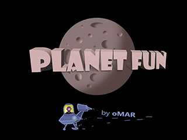

# PlanetFun      

In short: *PlanetFun* is a 4d solar system simulation with augmented reality. 
Celestial object spheres are rigged to astronomical almanac, resulting in realistic positions and movements. 

The app is developed in Delphi Pascal (Firemonkey 3D). 
Tested on Windows, Android and iOS (currently Delphi 11)

*Download app for iOS or Android from your app store. search for "PlanetFun" by "omarreis"*

*also available for Windows ( see below )*

Full app source available at:

* https://github.com/omarreis/vsop2013/tree/master/planetfun

## release notes

ago-23 - PlanetFun 2.1 release ( iOS, Android and Win32 )
* fixed phone roll ( model was rolling to the wrong side )
* Added program translations using TLang. Besides english, interfaces for French, Portuguese, Spanish and Italian.

apr-23 - PlanetFun 1.9 released
* Almanac module allow exploring the astronomical calculations using various methods 
* Ecliptic dots 
* constellation drawings ( 2 new backgrounds )
* Click a 3D object to see Almanac data

nov-20 - PlanetFun version 1.4 released
* Added toolbar for camera manipulation
* Moon correct position ( using Astronomical Almanac )
* release for iOS and Android 

oct-20 - PlanetFun version 1.3 released
* Integrated phone sensors to the 3D simulation ( GPS, accelerometer and mag compass )
* A fairly large *lighthouse* is positioned at your GPS position
* On the lighthouse there is a phone. The virtual phone attitude (Azimuth,Elevation and Roll) is controlled by phone sensors 
* Target (=attach) the *camera* to the *phone* to enter augmented reality mode.  
* Permissions for "sensor use while using the app" required

# Program features

* Solar system scene in 3D with 9 planets, Sun, Moon and 150 brightest stars.
* Time *animation* with configurable speed
* Choose camera target: Sun, Moon, planets, lighthouse or phone)
* Set date/time bewteen years 1500 and 3000
* Configurable camera distance-to-target
* Planet orbit dots. Each orbit is represented by 52 dots. For Earth, each dot = 1 week
* Ecliptic dots.
* Heliocentric axis (x and z)
* VSOP2013 planet position calculator usage sample
* Moon positions realistic, except for orbit size 
* Almanac data: Sun, 9 planets, Moon and 150 brightest stars.
* Sky background with 42k stars
* names of stars and constellation. constellation lines
* Costellation drawings with greek mythical figures
* a giant lighthouse and a phone shown on your position ( uses GPS, gyro and compass )
* phone model moves in sync with actual phone
* Target camera to the phone to enter augmented reality mode ( the scene rotates in sync with the real world )
* Touch gestures: one finger pan, two finger zoom and two finger rotation (on mobile)
* Mouse events: mouse-move, Shift mouse-move and Alt mouse-move (on Windows)
* Multi platform: Android, iOS and Windows ( Delphi Firemonkey app)

## Implementation notes

# Planet positions

Planet positions are calculated using VSOP2013 theory ( see https://github.com/omarreis/vsop2013 ). This library calculates planet's heliocentric ecliptic coordinates for a range of 9000 years ( VSOP2013 by Francou and Simon )

VSOP2013 original FTP repository: 

* https://ftp.imcce.fr/pub/ephem/planets/vsop2013/ephemerides/

For speed and small bundle size, PlanetFun app uses a custom binary version of VSOP2013 data. This is the same idea used in original vsop2013 (i.e. using a fixed size binary record to allow fast record access), but with a different implementation, as it is difficult to share binary records cross different languages (Fortran and Pascal). 

Steps to obtain VSOP2013 binary data file for deploying with *PlanetFun*:

* Download VSOP2013.p2000 from the FTP repository above ( a 400 MB text file) 
* Use program *TestVSOP2013* to Load VSOP2013.p2000 text file.
* Save binary file VSOP2013.p2000.bin.   Do *not* use binary files from original FTP repository.  Binary files for this app use a different custom format.
* Deploy file VSOP2013.p2000.bin to app's documents folder. 

Resulting binary file is *only* 131 MB and doesn't require parsing to load. Loads much faster. 

# PlanetFun 3D scene

The program uses heliocentric ecliptic coordinates, a convention suitable to deal with planets.
( The same as VSOP2013 )

PlanetFun 3D scene scale is:

    1 AU = 1 "3D unit"    ( 1 AU Astronomic Unit is  149.597.870,7 Km - mean distance Earth-Sun  )
    
Plane X,Y contains the planet orbits, with Z generally small.    
    
# Time

VSOP2013 time frame is J2000.0 (Equinox 1/jan/2000 12:00 UT). 
Epoch reduction is done by correcting for Precession, Nutation, Aberration, Proper motion.

Time calculations start with local time. Convert to UT ( Universal Time,  same as GMT old Greenwitch Meridian Time) 

UT = Localtime + TimeZone     

UT is converted to TDT (Terrestrial Dynamical Time) by adding DeltaT. 
TDT is used in astronomical calculations because UT is not uniform 
( astronomers insert seconds on UT sometimes )
TDT is uniform, consistent with atomic time.

Normally time is converted JD (Julian Date) and counted since J2000.0. 
Many AA functions use time parameter in "Centuries since j2000"

While VSOP2013 specifies TDB (Barycentrc Dynamical Time), 
the app uses TDT ( aka Terrestrial Time ).

A clock in Paris runs differently from a clock in the solar system baricenter 
due to General Relativity effects (movements, gravity). TDB accounts for that. 
The difference between TDB and TDT is small, I suppose. [Check!]   

# 3D Hierarchy

The solar system is modelled by a hierarchy of 3D objects, mostly TDummys and TSpheres.    

VSOP2013 provides heliocentric ecliptic cartesian planet positions (X,Y,Z)
in astronomical units (AU).  The plane of the Ecliptic for J2000.0 is Z=0.
Similar scale was adopted by this app. 

Planets consist of TSpheres, each parented to a TDummy.
Planet position is set using TDummyXXX.Position. 
Planet rotation uses TSphereXXX.RotationAngle.
It is ok to use RotationAngle if you change at most 2 components.
( if changing 3, use quaternion rotation )

For the Moon we have ELP2000 geocentric spherical coordinates ( GHA, decl, radius ) 
These are used to rotate dummyMoonOrbitCenter, which is attached to dummyEarth.
This makes the Moon rotate around Earth. Moon orbit radius is not used at this time ( a fake larger orbit is used )

Earth rotation is based on GAST (Greenwitch Apparent Sidereal Time). 

Both the Earth and celestial sphere are tilted by 23°26′ (ecliptic obliquity) . 
Other planets orbit's are nearly parallel to Earth's, the Z coordinate is usualy small.

Augmented reality mode uses phone azimuth-elevation-roll sensor properties ( FiremonkeySensorFusion component )
to set 3D phone corresponding attitude. Used quaternions to apply rotation in multiple axis
instead of messing with object's RotationAngle. 

A helper class was set for manipulating the 3D object transformation Matrix ( i.e. expose SetMatrix() ). 

Scene uses only one light: a Sun centered ambient light.
This results in correct object ilumination phenomena (ex: Moon disk ilumination) 
as a secondary result of the model  :)
But no shadows cast yet.

dummyCamera is the camera *target*. The camera is parented to it at a certain distance.
Targetting the camera means parenting dummyCamera to object at position (0,0,0).
Camera Target, distance and other config can be set from Camera settings.

TODO: cast shadows on other objects. 

# RotationAngle and gimbal locks

Firemonkey 3D objects expose properties *Position* and *RotationAngle* to specify object attitude
in relation to parent. You probably heard that *RotationAngle* must be used with care,
to avoid the object going into a locked state after repeated rotations. This is called "gimbal lock".
In this situation, reverting the object *RotationAngle* to (0,0,0) no longer works.
The object refuses to return to default position. Some rotation combinations become unreachable. 
There is a loss of a degree of freedom.

I suppose *RotationAngle* was exposed to "simplify" 3D programming, rather than using transformation matrixes,
but it is a trap and a source of frustation.

Options to avoid the Gimbal Locks when you rotate objects:

1- Use *Quaternions*, as exemplified in the app for phone rotations in sync with sensors. 

Generate a quaternion of 3D rotations and use SetMatrix() to apply all rotations at once. 

    // use quaternion to apply sensor readings
    ToQuaternion( aRoll, aAzimuth-90 , aAltitude, Q );
    cubePhone.SetMatrix( Q );                   // rotate phone model using the quaternion

Note that SetMatrix() exists, but is not a public  method of 3D objects.
Used a helper class to expose the method.

2- Use an object parented to a dummy and change one component of RotationAngle on each.

For example if you have the construction: 
  
     -- aDummy --- a3DObject
     
You can do:

    aDummy.RotationAngle.x    :=  aAltitude;     //set one rotation component in each object
    a3DObject.RotationAngle.y :=  aAzimuth;

This is similar to actual camera gimbals, found in drones: each servo rotates in one axis only, but they are linked together to allow 3D movements.  
By using this construction, the object rotates as expected and you avoid gimbal locks.

## Celestial object calculator classes  
                                             
TCelObjBase is the base class for coordinate calculators. Each class must implement (override) 2 methods.

* CalcCoordinates - calculates object geocentric equatorial coordinates for a given time
* GetObjectData   - returns a verbose report about the calculation procedure, with intermediate results.

SetGMT is used to trigger the calculation

                              TCelObjBase (abstract)                       
                                     |                                     
         +--------------+------------+---------------------+---------+     
         |              |            |                     |         |     
         |              |         TStarBase  (abstract)    |         |     
         |              |            |                     |         |     
         |              |            +------------+        |         |     
         |              |            |            |        |         |     
    TPlanetVSOP2013   TPlanetVSOP87  TStarH150  TNavStar  TSun      TMoon   

Calculation results can be found on the object fields:

    fGMT:TDateTime;      // current time ( use setGMT to calculate coordinates )
    fTDT:TDateTime;      // goodol' TDT (Time Dynamical) Today is called TT ( Terrestrial Time ? )
    // celestial coordinate results
    fRA,fDecl:Double;    // current coordinates Right Ascension, Declination
    fGHA:Double;         // Current Greenwich Hour Angle
    
SHA (Sidereal Hour Angle) can be obtained by:   SHA = 360°  – RA

## Moon positions 

Moon position calculations and data coefficients from ELP2000 ( Chapront-Touzé ) described in Meeus' Astronomical Algorithms (chapter 45).
Delphi Implementation of ELP2000 from TMoon v2.0 component by (c)Andreas Hörstemeier: http://www.hoerstemeier.com/moon.htm

Andreas Hörstemeier's TMoon component was released to public domain according to component help file.
Code in ahMoon.pas is derived from TMoon component.

## Sun positions

TSun object implements two calculation methods ( High and Low res, as described in AA )  
Sun geocentric equatorial coordinates are derived from Earth's VSOP87 heliocentric coords.

This corresponds to the high res method, that uses VSOP87

see VSOP87.SunData.pas 

# Planet textures

Planets are represented by TSpheres with light reflecting surfaces ( TLightMaterialSource )
The Texture property is a bitmap that is mapped to the sphere.  

Planet textures are *not* included in this repository. Design time objects have blank textures.
Textures are loaded at runtime on FormCreate.

PlanetFun planet textures come from the website:

*Solar System Scope*   https://www.solarsystemscope.com/textures/  

If you want to build and deploy PanetFun follow these steps to complete assets:

* Download images from Solar System Scope. Program uses 2k_earth_daymap.jpg, 2k_jupiter.jpg, 2k_mars.jpg, 2k_mercury.jpg, 2k_moon.jpg, 2k_neptune.jpg, 2k_saturn.jpg, 2k_stars_milky_way.jpg, 2k_uranus.jpg, 2k_venus_surface.jpg and PlutoTexture.jpg
* Deploy texture files to Documents folder 
* also deploy VSOP2013.p2000.bin 
* and SkyMapLinesNames.png, SkyMapPlain.png, SkyMapDrawings, SkyMapLinesNamesDrawings.png   (from this repo)

see PlanetFun deployments: https://github.com/omarreis/vsop2013/tree/master/Documents

Follow *Solar System Scope* license conditions

# Star background 

The sky background is a large sphere with radius 200 AU. The texture image contains stars, constellation lines, names, constellation drawings  etc. 
It was generated using Hipparcos Input Catalogue (118k stars).  Only objects with mag<8.0 were kept, resulting in about 42000 stars.

4 star background images are available: stars with names, lines, constellation drawings or just plain stars.
Selecting visibility checkboxes determines which background is used.

Since the texture is projected on the inside of the large sphereSkyBackground,
images must be flipped horizontaly to project correctly with left-to-right texts.
The celestial sphere can be seen from the "outside" if camera distance is set to more than 200 AU.

Sky texture images: 

* https://github.com/omarreis/vsop2013/blob/master/Documents/SkyMapLinesNames.png   
* https://github.com/omarreis/vsop2013/blob/master/Documents/SkyMapPlain.png
* https://github.com/omarreis/vsop2013/blob/master/Documents/SkyMapLinesNamesDrawings.png
* https://github.com/omarreis/vsop2013/blob/master/Documents/SkyMapDrawings.png

In addition the 150 brightest stars are also represented by little white 3D spheres.
These are located at 200 AU from the Sun, so they are on the background sphere surface ( half in - half out )
so that they can be seen from both inside and outside the celestial ball.

                               
                            dummyCelestialSphere
                                      |
            sphereSkyBackground ------+------ 150 star spheres 
            
          
The app main coordinate system is heliocentric ecliptic (x,y,z).
This is the same system as VSOP2013, the planet positions calculator.

For some objects, Almanac calculation methods return Right Ascension,Declination (RA/Decl), 
which are geocentric equatorial coordinates. Between the two systems there is
the inclination of the ecliptic (obliquity) which is about 23°26'.

                                       .-- Ecliptic
                                   .--- 
                            A  .---  
                 -----------+------------- Equator
                       .---   
                   .--- 

By setting dummyCelestialSphere.RotationAngle.x to 336.5667 ( i.e. -23°26'  obliquity )
and parenting the individual stars to dummyCelestialSphere (the celestial sphere) 
we gain automatic translation between equatorial and ecliptic systems. 
Objects with Equatorial coordinates can be parented to dummyCelestialSphere.
Objects with Ecliptical coords can be parented to root ( SolarSystemViewport3D ).

This way we can use raw coordinates for various calculation methods. 
For example, Ecliptic dots are created by positioning them at Z=0 plane.
Since Ecliptic dots are parented to root, they show as an inclined
circle in relation to the Equator.

Object coordinate calculation methods ( ephemeris ):

    obj        method      Results
    Planets    VSOP2013    X,Y,Z heliocentric ecliptic 
    Planets    VSOP87      heliocentric lat,lon,Radius --> RA, Declination
    Moon       ELP2000     geocentric equatorial RA, Declination, radius
    Stars      catalog     geocentric equatorial RA, Declination
    Sun        VSOP87      geocentric equatorial RA, Declination, radius 

sphereSkyBackground (sky image) is also parented to dummyCelestialSphere.

sphereSkyBackground.RotationAngle.y is set 359.6 to make the texture "fit" the actual star spheres,
which have more accurate position. 
( the image left displacement may be due to date J2000. There was precession since )

sphereEarth is rotated in the same fashion, so both Earth and celestial sphere share the same Equator plane.

# Not realistic

A number of cheats introduced in v1.0 were corrected in subsequent versions. 
Still remain:
* Solar and planet sizes are difficult for visualization. The Sun radius is more than 100x that of the Earth. Distance between planets and the Sun are even larger. If you do a program using actual proportional object sizes, you end up with a black screen and some tiny dots. Not really exciting.   I applied a custom log formula to Sun and planet sizes, so that the Sun is only about 4 times the size of the Earth. Anyway, planet scale can be configured for more visible planet details.
* Moon orbit size is not realistic. Used a larger fake size. But Moon geocentric GHA and declination are ok ( since v1.4 )   
* Version 1.3 includes sky background textures ( two maps, with and without names & lines )

# Dependencies
*  Uses native sensor code from KastriFree. DelphiWorlds (files with DW. prefix) 
   http://www.delphiworlds.com 
*  TMoon v2.0 component by Andreas Hörstemeier: http://www.hoerstemeier.com/moon.htm
*  Uses astronomy code from https://github.com/omarreis/vsop2013/
*  Uses sensor fusion component from https://github.com/omarreis/FiremonkeySensorFusion

# Astronomical Algorithms formulas
Many formulas and algorithms for dates and astronomy from the book "Astronomical Algorithms" by Jean Meeus.
See file Om.AstronomicalAlgorithms.pas

# Augmented Reality
On the surface of Earth's sphere, at your GPS position, there is a large lighthouse. 
On top of that lighthouse is a phone. 
The position of the phone reflects actual device sensors ( location, gyro and magnetometer ) and 
should mimic its attitude (move with the real phone).  

The app uses *FiremonkeySensorFusion* component to mix sensor readings ( see dependencies)

       phone attitude 
          -Y     Z       Altitude or Elevation -  X up positive
           |    /        Heading or Azimuth    -  Y down positive
           |   /         Roll                  -  Z positive into the screen
       /=======\
       |   | / |
       |   |/  |
       |   *---|--------- X
       |       |
       |   O   |
       \-------/

What happens when you attach the scene *camera* to the *phone* ?  
The simulation starts to move in sync with actual Universe.
The image on the screen matches the actual point you are targeting the phone to.
More or less...

To enter AR mode, click [Camera] to open camera settings. Set Camera Target to "phone" (  or click the phone icon ) 

# Permissions
PlanetFun uses permissions for location, gyro and magnetic sensors.
Program works without these with limited features.

# video
https://www.tiktok.com/@omar_reis/video/6859411602031119622

# Facebook
FB page: https://www.facebook.com/vrtoolsoftware

keywords: solar system planet astronomy vsop2013 Delphi Firemonkey

## download Android app
https://play.google.com/store/apps/details?id=com.omarreis.planetfun

## download iOS app
https://apps.apple.com/us/app/planet-fun/id1525941640

## Download for Windows ( Win32 )

PlanetFun v1.9 installer: https://github.com/omarreis/vsop2013/releases/download/1.9/setupPlanetFunV19win32.exe

Installs executables PlanetFun, TestVSOP2013 and GravityIntegration on program group "vsop2013"

## also in this repository

* vsop2013 ephemerides for Delphi: https://github.com/omarreis/vsop2013/README.md
* gravity integration tool: https://github.com/omarreis/vsop2013/tree/master/gravityIntegration/README.md
* planetFun app: https://github.com/omarreis/vsop2013/tree/master/planetfun/README.md
* Neptune discovery: https://github.com/omarreis/vsop2013/blob/master/gravityIntegration/NeptuneDiscovery/README.md

