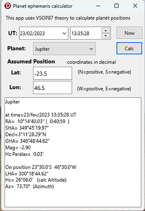

# VSOP87 test app

Test app for VSOP87 planet position calculator
Delphi Firemonkey app

Parameters:

* select Star name
* set Date ( Universal Time a.k.a GMT ) 
* set navigator Assumed Position ( Lat and Lon )

returns Star celestial position:

* RA ( Right Ascension in degrees and hours )
* Decl ( Declination in degrees ) 
* GHA ( Greenwich Hour Angle )
* SHA ( Sidereal Hour Angle )
* Magnitude ( star brightness, lower number=more  bright ) 

At navigator's Earth position:

* LHA ( Local Hour Anmgle )
* Hc ( Calculated Altitude) 
* Az ( Azimuth )

## Dependencies  

Uses files from /omarreis/vsop2013
