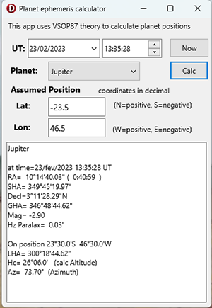

# VSOP87 planet positions calculator

* VSOP87 = Variations Seculaires des Orbites Planetaires 1987
* by Bretagnon and Francou - Bureau des Longitudes of Paris
* calculates planet's ecliptical coordinates Lon,Lat and Heliocentric Radius, given a time
* This method is described in J.Meeus book "Astronomical Algorithms" - Chapter 32, used as basis for this code.
* Includes planets Mercury, Venus, Earth, Mars, Saturn, Jupiter, Neptune, Uranus

Note that this repository also contains newer VSOP2013 theory, more precise.
VSOP2013 includes 9 planets and larger time domain.
However VSOP2013 requires a large 100 MB table of coeficients, which makes it
difficult to use in mobile devices.

VSOP87 gives good enough results for most apps, using a smaller set of data coeficients.
In this implementation the coeficients are embedded as code constants, rather than a separate file ( as in VSOP2013 )

## Demo app

See *Demo* folder

Parameters:

* select Star name
* set Date ( Universal Time a.k.a GMT ) 
* set navigator Assumed Position ( Lat and Lon )

returns Star celestial position:

* RA ( Right Ascension in degrees and hours )
* Decl ( Declination in degrees ) 
* GHA ( Greenwich Hour Angle )
* SHA ( Sidereal Hour Angle )
* Magnitude ( star brightness, lower number=more  bright ) 

At navigator's Earth position:

* LHA ( Local Hour Anmgle )
* Hc ( Calculated Altitude) 
* Az ( Azimuth )

## Dependencies  

Uses files from /omarreis/vsop2013

